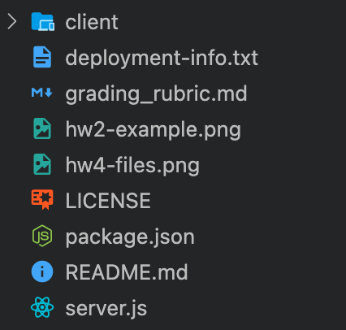

# CIS 557 HW4: Guess the Celebrity MERN/MySQLERN App

## Overview:

This is the last step in implementing our app.
In this assignment, you will:

- **Implement an Express.js server running on NodeJS for the backend**
- **Use either MongoDB or SQL as your database**
- **Test your backend code**
- **Deploy your application (frontend and backend) to Heroku**

If you choose to use MongoDB as your database, then you will be building a MERN (Mongo + Express + React + Node) application. Similarly, for SQL it will be a MySQLERN application. It is highly recommended to use the database you will be using for your project to get some practice.

Make sure you follow the setup instructions carefully so that you will avoid headaches down the line.

## Setup:

### Setting up the backend

- In the root of your repository, run `npm install` to get all the base server dependencies installed
- Now run the command `npm start`.
  - You should get a message saying "Server running on port: 5000"
- Navigate to http://localhost:5000, where you should see a blank page containing ` {"message":"Welcome to HW4 Backend"}`
- Congrats! You have the initial backend set up, now you need to connect to the database and define your routes (marked as _TODO_ in the `server.js` file)
- You can stop your server with Ctrl-C
- It is strongly recommended to create one or more modules with database and other necessary functions to make it easier to unit test.

### Connecting to a database

- If you decide to use a SQL database, then make sure you have an AWS account (you can sign up [here](https://portal.aws.amazon.com/billing/signup#/start)).
  - Navigate to the RDS service where you will create an RDS database. The guide is found [here](https://docs.aws.amazon.com/AmazonRDS/latest/UserGuide/USER_CreateDBInstance.html).
  - Keep track of your DB credentials as you will need them to connect from your backend.
  - We recommend installing the [mysql2 package](https://www.npmjs.com/package/mysql2) to connect and send queries to your database
- If you decide to use Mongo, then sign up for an account [here](https://account.mongodb.com/account/register).
  - A guide to setting up a free database with Atlas can be found [here](https://intercom.help/mongodb-atlas/en/articles/3013643-creating-databases-and-collections-for-atlas-clusters)
  - We recommend installing the [mongoose package](https://www.npmjs.com/package/mongoose) or [mongodb driver](https://www.npmjs.com/package/mongodb) to connect and send queries to your database.

### Setting up the frontend

- You will be using your HW3 frontend for this assignment.
- You can copy all your files into the directory (make sure all files are within a "client" folder).
- You don't need to copy over your frontend unit or snapshot tests (copy over Cypress tests only!)

### Deployment

- Sign up for a Heroku account [here](https://signup.heroku.com/)
- We will have a workshop covering how to deploy but feel free to deploy on your own if you already have experience or if you want to follow an online tutorial
- Make sure you put the URL where your application is deployed in the `deployment-info.txt` file

At this point your file structure should look like the image below (the `client` folder name will vary depending on your HW3 client name):

## REST API:

The API documentation is available on Swagger (https://app.swaggerhub.com/apis/ericfouh/CIS557_HW_REST_API/1.0.0).

Take some time to go over the documentation as your app must follow its specifications:

- Your database should capture all the information described in the models section of the API
- Your modules (frontend and backend) must implement the operations listed under each path (endpoints) use the same names. For example addPlayer in the frontend will collect all the information from the react view and send the HTTP (POST) request to the backend, while the addPlayer on the backend will receive all the information from express and store it in the database.
- You must return the status code and data listed in the API

## Running and interacting with the backend:

- To start the backend, run `npm start` in the terminal.
- The express server will listen on port 5000. You can
  change the port in server.js (variable `port`).
- You can use your browser to manually test your **GET** endpoints and Postman (found [here](https://www.postman.com/downloads/)) to test all your endpoints.

## Testing:

- Make sure you create a `.travis.yml` file
- You must perform **unit and integrations tests** on the backend
- Your backend tests should achieve the highest code coverage possible (>= 80%)
- You should link TravisCI with your GitHub repository and create corresponding files in your backend for tests.

## Validation:

- Your JavaScript must be clean, readable, and **_ESLint warning-free_** (Airbnb style)

## Github:

- You should continue to follow branching and merging guidelines similar to the previous homework assignments.

## Submission:

- Please make sure your deployment information is in the `deployment-info.txt` file.
- Do not forget to commit your work to GitHub regularly.
- Only the last push before the due date will be graded.
- Do not forget to submit on Gradescope (25% penalty for TA manual submissions).
